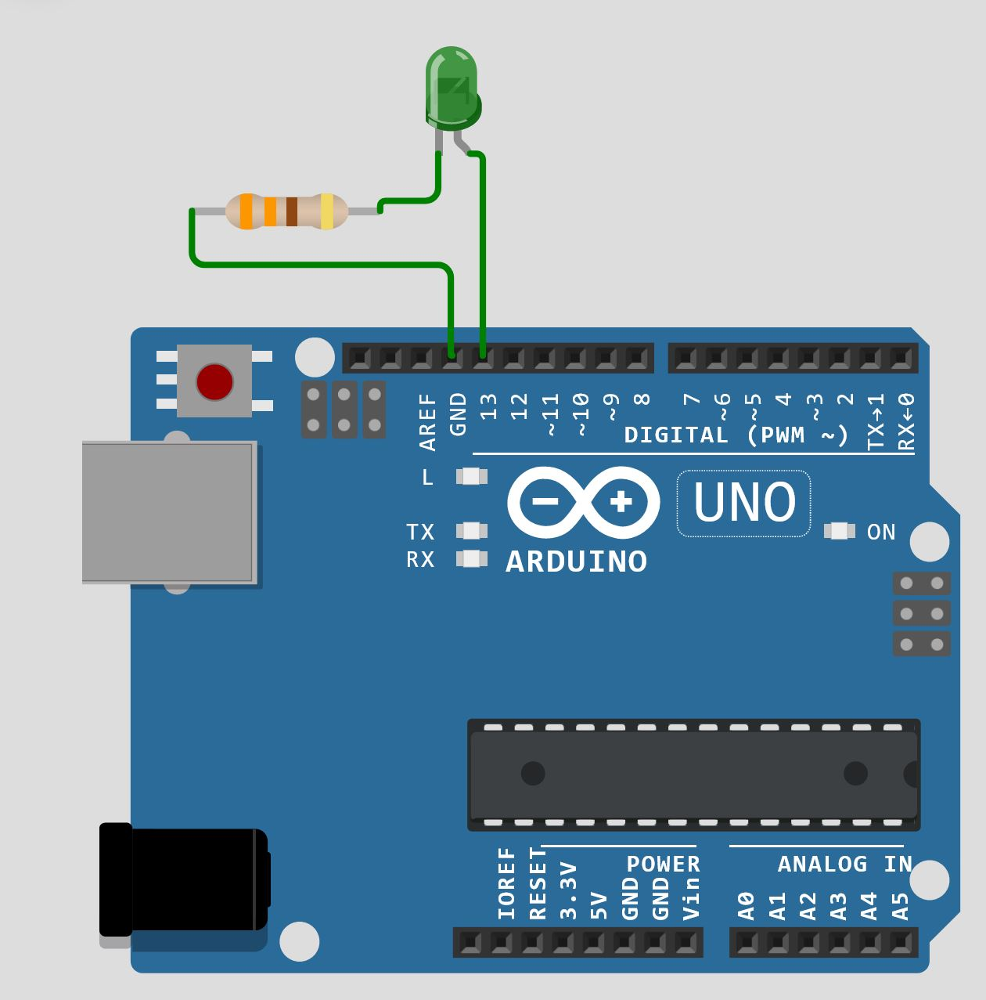
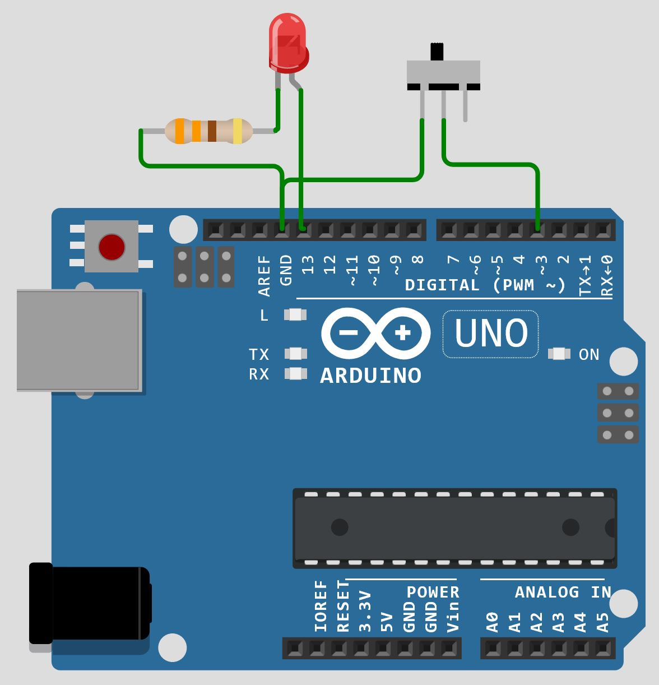
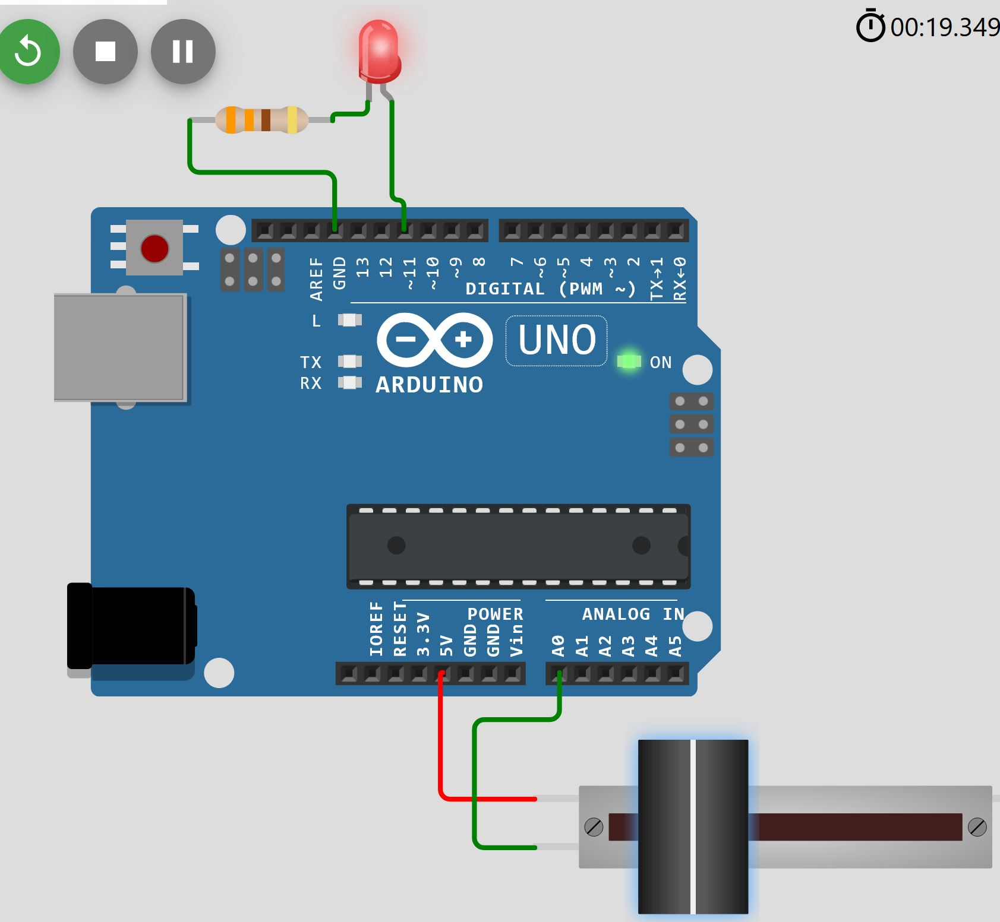
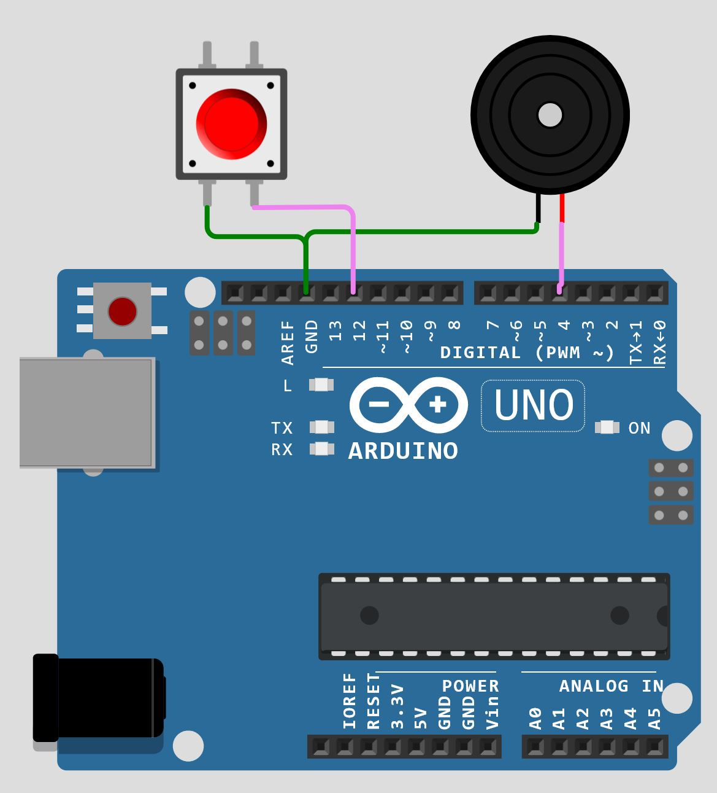
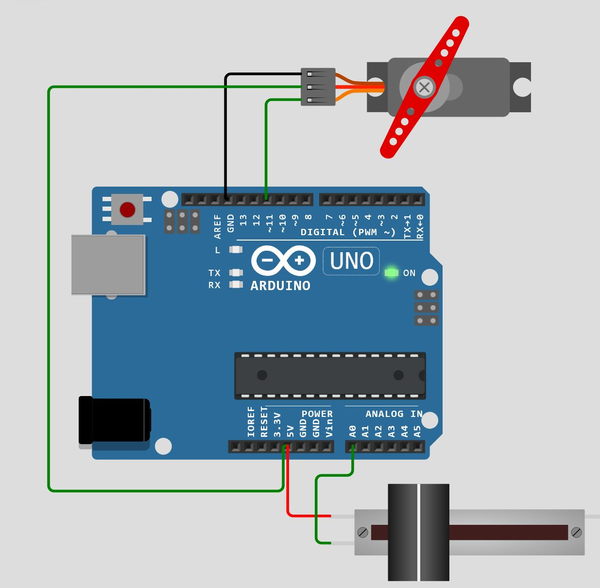

# Arduino Tutorial
1. **LED Blinking:** We use an LED (Light Emitting Diode), which is connected to the Arduino via a resistor. The resistor limits the current that flows through the LED to prevent it from burning by too much current. 
 - The **pinMode()** defines the pin of Arduino that is connected to the LED as **OUTPUT**, **INPUT**, or **INPUT_PULLUP**. 
 - Function **delay()** pauses the program for the amount of time in milliseconds.
 - Function **digitalWrite()** sets the value of the given digital pin as HIGH or LOW.

<a href="https://wokwi.com/projects/374869964416433153" >LED Blinking: click to see the live demo., and get the code</a>

2. **Slide switch to turn ON and OFF an LED:** We use a slide switch to turn an LED ON and OFF. As before, the LED is connected to the Arduino via a resistor. 
 - We define the pin of Arduino that is connencted to the common contact of the switch, as **INPUT_PULLUP**, which means that this pin is an input, and it is HIGH by default, if it is not connected to the GROUND.

<a href="https://wokwi.com/projects/375711320031687681" >Slide switch to toggle LED: click to see the live demo., and get the code</a>

3. **Controlling the brightness of an LED with slide potentiometer:** A slide potentiometer is connected to an analog pin from which the value is taken to change the brightness of an LED connected to a PWM (Pulse Width Modulation) pin. 
 - **analogRead()** is a function that can read analog values from the analog pins A0, A1, A2, A3, A4, and A5. Such pins get the values in integer forms, ranging from 0 to 1023.
 - **analgWrite()** writes an analog value in the pins denoted by ~ on the board. For Arduino uno, these pins are: 3, 5, 6, 9, 10, and 11. The analog value is created by PWM. To be more specific, the duty cycle of a rectangular wave is changed based on the desired analog value.

<a href="https://wokwi.com/projects/376216892255611905" >LED Brightness change with slide potentiometer: click to see the live demo., and get the code</a>

4. **Playing a frequency on speaker with pushbutton:** A pushbutton is used to play a frequency on the speaker. By pressing or press-and-holding the pushbutton, the speaker gets a square wave, which we can hear it.
 - **tone(pin,frequency) or tone(pin,frequency,duration)** is a function that creates a square wave having 50% duty cycle with the specified frequency in Hertz. If duration (in milliseconds) is given, it generates the square wave for the given duration.
 - **noTone(pin)** stops the frequency generation on the given pin.

<a href="https://wokwi.com/projects/376316961305570305" >Generating sound with given frequency by pressing pushbutton: click to see the live demo., and get the code</a>

5. **By sliding the potentiometer, the angle of servo motor is changed:** A slide potentiometer is connected to arduino via an analog pin. Also a servo motor signal pin is connected to a PWM pin of arduino. We use the Servo library to control the angle of servo motor by sliding the potentiometer.
 - **Servo myservo** is employed to create an object of Servo from Servo library, here named *myservo*.
 - **myservo.attach(servo_pin)** attaches the servo motor with the specified pin, *servo_pin*, to the Servo object.
 - **myservo.write(angle)** sets the angle of servo motor to the specified angle.

<a href="https://wokwi.com/projects/376507175360773121" >Setting servo motor angle by a slide potentiometer: click to see the live demo., and get the code</a>

